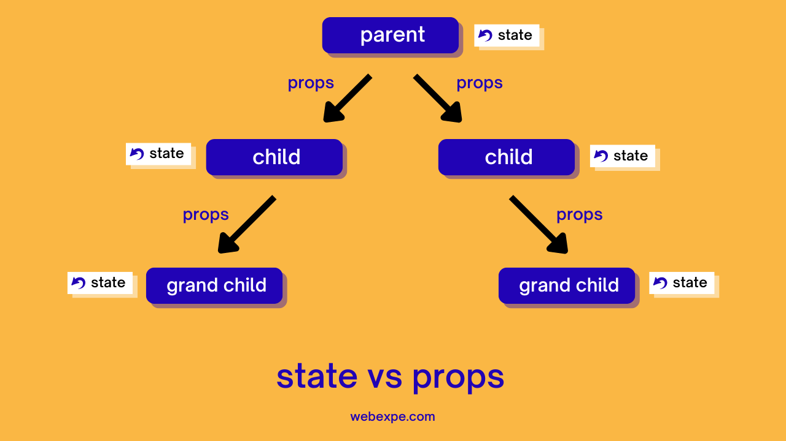
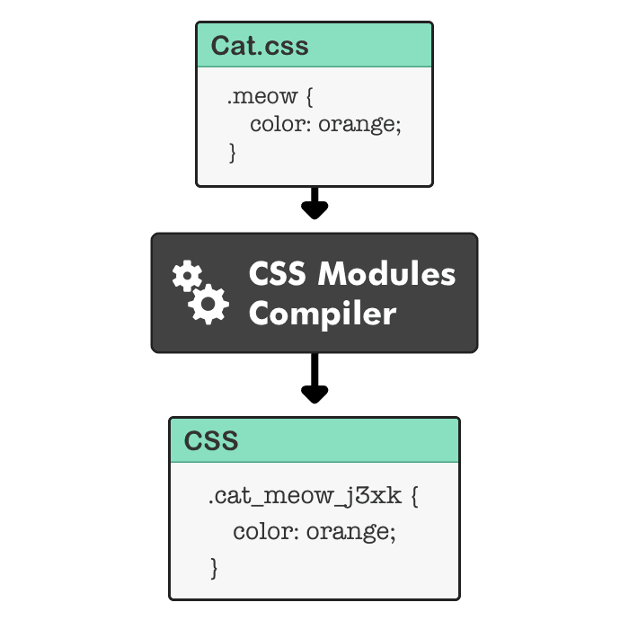
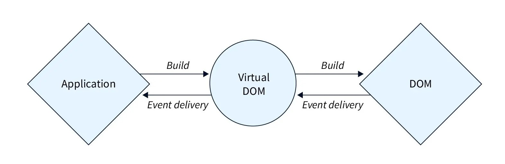
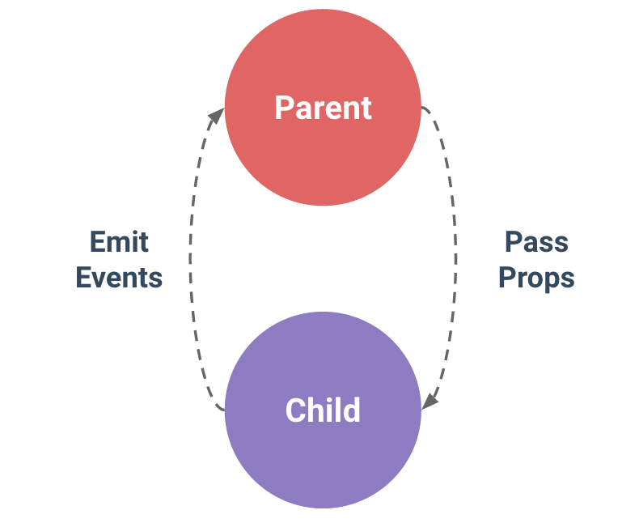
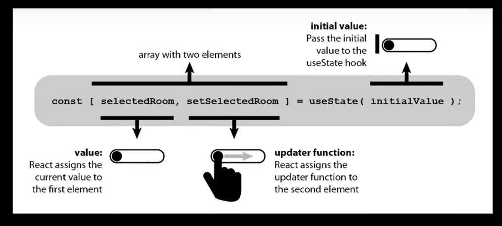

# **Step1**

## Install Latest Node

To Make Server (Server banana)
Application Ko Serve Karna(Koi Bhi Client Aaega Browser pe ya App pe to unko Website Load Karne Ke Liye Relevant File Provide Karna)

React Bhi Same Kaam karta hai (user aata hai toh usko relevant file provide karta hai)

Ek Light Type ka server banta hai jo humari file ko serve karta hai

```
Search and Download Node According to your OS (use LTS- Long Term Support)
```

- **Step2**

## Install OR Update VS Code

Install VS Code in Your Pc

> install The extension and Set The Setting OF VS code

1. Live Server / Live Preview
2. Prettier (Format on Save)
3. Line Wrap
4. Tab Size 4 to 2

- **Step3**

## Create React App

This is the official Tool for Creating React used By facebook

```json
"React Use" : npm start  "To launch The Server"
```

- **Step4**

## Vite x React

Vite is a modern tool to create React App

vite Produces Quick and Small Bundle Size

Yeh **HotSwap** and **HotReload** karta hai

```json
"Vite Use" : npm run dev "To launch The Server"
```

- **Step5**

## Creating the React Project With Vite

GO to the Terminal of Any Code Editor and Write

```json
" npm - NODE Package Manager "
npm create vite@latest
```

Give the Project name

```json
"Project name" : name-of-your- project

"Select a FrameWork" : in our case we will use "React"

"select the language" : in our case we will use "JavaScript"

```

After Running the above code Your Project Will be Created and Will Give you Some Command To Run

```json
1. cd your-project-name
2. npm install "Install all The Dependency"
3. npm run dev "Server Chalne ke liye use karna hai"
```

> after running the server it will give us a localhost url

- **Step6**

## Project Structure

1. <span style= "color:yellow ; "> Node Module</span>: It stores all the dependency and Library code for the React & other Library and Frameworks

<span style="color:red " >
  <p style="text-align: center;">Yeh Package ko Chedna Nahi Hai</p>
</span>

2. <span style= "color:yellow ; "> Public / Directory</span>: Contain static files that don't change **Generally images are stored in this folder**

3. <span style= "color:yellow ; "> Src </span>: Main Folder for the React Code.

   - Assets : Images , FOnts and Other Static File Will be Stored Here.
   - Components : React Components Will be Stored Here, like Header , Navbar , Buttons and many more
   - Styles : CSSor Stylesheets will be stored here

4. <span style= "color:yellow ; "> eslintric.cjs </span>: Yeh uss tool ka naam jo batata hai ki aapne code mai kuch galat likha hai kya? Ya phir koi warnings hai kya?

5. <span style= "color:yellow ; "> gitignore </span>: iske andar woh file hoti hai jo hum chahate hai ki git mai check in / upload na ho

6. <span style= "color:yellow ; "> Package.json </span>: It Contain Meta Data. Project ke baare mai jo bhi important information hai woh sab ishi file mai hogi. It contains Things like:-

- ```json
  "Project Name": "Your-Project-name"
  "version": "0.0.0"
  "Scripts":
  "dependencies":
  "devDependencies": "Jo Hame Project Banane mai chahiye par deploy  karte waqt nahi"
  ```

7. <span style= "color:yellow ; "> vite.config.js </span>: It is used to Modify the Behaviour of Vite

8. <span style= "color:yellow ; " > package-lock.json </span>: Ismai Yeh Pata Chalstyle= "color:yellow ; "ega ki Kya finally Use hua.

# Create React Component

- File Extension :

```json
" .JS" {
  * "Stands For Javascript" :
  * "Contains Regular Javascript Code" :
  * "Use for General Logic and  Component" :
}

".JSX" {
  * "Stands For Javascript XML" :
  * "Combine JavaScript with HTML-Like tags" :
  * "Makes it Easier to design UI Components" :
}
```

- Class vs Function Component

```json
"Class Components"{
  * "Stateful":"Can Manage State"
  * "LifeCycle":"Access To LifeCycle Methods"
  * "Verbose":"More Boilerplate Code"
  * "Not Preffered Anymore":
}

"Functional Components"{
  * " Initally Stateless":"Can't Manage State"
  * "Can use Hooks for state and effects":
  * "Simpler and More COnsise":
  * "Preffered Nowadays":"More Popular"
}
```

- What is JSX?

  - Definiton : JSX is a syntax extension for JavaScript that allows you to write HTML-like code within your JavaScript files. It provides a way to seamlessly integrate HTML into your JavaScript, making it easier to build user interfaces. JSX is not a separate language but rather an extension of JavaScript syntax.

  - Not HTML : Though it resembls HTMl,you're actually writing JSX

  - Conversion : JSX gets COnverted to Regular JavaScript

  - Babeljs.io/repl : It is a Tool that allows you to see how JSX is transformed into JavaScript

- Exporting Components
  - Exporting Components is a way to make them available to other parts of your application.
  #### Types of Exporting a Component
  1. One Default Export
     ```json
     Allows Exporting a single component as the default from a module
     This can be done for single component but avoid doing it instead write it at the end
     "export default function App(){
       ......
     }"
     ```
  2. Multiple Named Exports
     ```json
     we can export Multiple Componenets from one file , but avoid doing it tooo.
     "export function Slider(){
       ....
     }"
     "export function Button(){
       ....
     }
     "
     ```
  3. Default and Named Exports
  ```json
  we can export Multiple Components and can export one Default Component
  "export function Checkbox(){
    ...
  }"
  "export default function App(){
    ....
  }"
  ```
  Importing : To Use and Exported component, you need to import it in the destination file using import syntax

# Other Important Points

1. <b>Naming</b>: Must Be Capitalized <br>
   LowerCase for Default HTML

2. <b>HTML</b> : Inlike Vanilla JS where you can't directly write HTMl, in React , you can embed HTML- Like Syntax using JSX

3. <b>CSS</b>: In React , CSS can be directly imported into component files , allowing for modular and component-specific styling.

# Dynamic Components

- <b>Dynamic Components</b> : Components that are created at runtime based on user input. JSX allows the creation of dynamic and interactive UI Component
- <b>JavaScript Expression</b> : Using {} we can embed any js expression directly within JSX. This includes variables, Function calls and more.

# Reusable Component

- <b>Modularity</b> : Components are modular, allowing for easy reuse across different parts of an application

- <b>Consistency</b> : Reusing components ensures UI consistency and reduces the chance of discrepancies-(differences or inconsistencies between things that are supposed to match or agree. )

- <b>Efficiency</b> : Reduces Development time and effort by avoiding duplication of code

- <b>Maintainability</b> : Changes made to a reused component reflect everywhere it's used, simplifying updates and bug fixes.

> ## Tag hamesha band Hoga Chahe Woh Self Closing ho ya pair mai

```json
"<App></App>" : Correct
"<App/>" : Correct
"<App>": Wrong
```

# Including BootStrap

1. Responsive : Mobile-First Design for all device Sizes

2. Components: Pre-Styled elemets like Buttons and Navbars.

3. Customizable : Modify default styles as needed.

4. Cross-Browser: Consistent Look accross Browsers.

5. Open-Source: Free with COmmunity Support.

```json
"InstallBootStrap in React"{
  "Command For installing BootStrap in React" : npm i bootstrap@5.3.3 "install the latest version available"
}
"Import BootStrap in Components"{
  "Importing BootStrap in React" : import 'bootstrap/dist/css/bootstrap.min.css'; "isse "
}
```

### Objects Are Not Valid As A React Child

```json
"Convert the Object to String"

"For Eg":"let time = new Date();"

"<p>This is The Current Time: {time.toLocaleDateString()}-{time.toLocaleTimeString()}</p>": "this is correct"

"<p>This is The Current Time: {time}</p>":"This is Incorrect"

```

# Fragments

### What is Fragments

- Fragments are a way to group a list of children without adding extra nodes to the DOM.
- Allows Grouping Of Multiples Elemets Without Extra DOM nodes.

### Why Use Fragments

- Fragments are useful when you need to group a list of children without adding extra nodes to the
- Return Multiple Elemets without a wrapping parent
- Cleaner DOM and Consistent Styling

### How to use Fragmets?

- Fragments are created using the `React.Fragment` component.

```json
"Normal Method":"<React.Fragment>....</React.Fragment>"
"SHort Method":"<>...</>"
```

- Pure Component ko Ek tag ke andar return karna padta hai nahi toh error aata hai, error niche mentioned bhi hai

```json
"Adjacent JSX elements must be wrapped in an enclosing tag. Did you want a JSX fragment <>...</>?"
```

> Iske 2 Solutions hai

1. Pure Component ko div mai daal dena

```json
This is Wrong
  "
    <h1>Hiii My Name is</h1>
    <p> Amaan </p>
  "
kyuke dono Tag ek hi level pe hai isliye error dega

This is Right
 "
 <div>
    <h1>Hiii My Name is</h1>
    <p> Amaan </p>
</div>
  "
  Issmai Dono ke upar ek Parent Daal diya yaani div daal diya taaki woh ek hi component samjhe  , Par uss div ko aur kuch kaam nahi hai siwae dono ek karne ke liye toh yeh ek acchi practice nahi hai
```

2. Fragment ka use karna

   Pahele hame Fragment ko import Karna hota

   `import React from "react";

```json
  This is Wrong
  "
    <h1>Hiii My Name is</h1>
    <p> Amaan </p>
  "
kyuke dono Tag ek hi level pe hai isliye error dega

This is Right
 "
  <React.Fragment>
    <h1>Hiii My Name is</h1>
    <p> Amaan </p>
  </React.Fragment>
  "
  Issmai Dono ke upar ek Parent Daal diya taaki woh ek hi component samjhe ,  Aur yeh koi extra level add nahi karta hai bus wrapper ka kaam karta hai

```

# Map Method

### The map method in JavaScript is used to create a new array by applying a function to each element of an existing array. It's a way to transform each item in an array into something else without changing the original array. The map method does not modify the original array but instead returns a new array with the transformed elements.

`Ek Type Ke Array ko Dusre Type mai Convert Karna `

```json
"const numbers" = [1, 2, 3, 4, 5];
"const squared" = numbers.map(num => num * num);
// output : 1,4,9,16,25
```

`Purpose` : Render List From the Array Data

`JSX Elements` : Transform array Items into JSX

## Keys allow React to keep track of elements. This way, if an item is updated or removed, only that item will be re-rendered instead of the entire list.Keys need to be unique to each sibling. But they can be duplicated globally. If you don't have a unique key, React will throw an error.

` Agar har item ko alag key dedenge toh react sirf new key ko hi update karna padega instead of pure items ko update karne se, Aur react ka bhi yahi motto hai`

# Conditional Rendering

Conditional rendering is a feature in React that allows you to render different components or elements based on a condition

- Conditional Rendering
  - Displaying Content Based on Certain Conditions.
  - Allows For Dynamic user Interfaces.
- Methods
  - If/Else Statements : Choose Between Two Blocks of COntent.
  - Ternary Operators : Quick Way TO Choose Between Two Options.
  - Switch Statements : Choose Between Multiple Blocks of Content.
  - Logical Operators " Useful for Rendering Content when a condition is true
- Benefits
  - Enhances user experience.
  - Reduces Unnecessary Rendering.
  - Makes Apps more Interactive and Responsive

### Falsy Values

Falsy values are values that are considered false in a boolean context. In JavaScript, the following values are :-

1. `false`: The boolean value false.
2. `0`: The number 0.
3. `""`: An empty string.
4. `null`: The null value, which represents the intentional absence of any object value.
5. `undefined`: The undefined value, which represents an uninitialized or non-existent variable.
6. `NaN (Not-a-Number)`: A special value that represents an invalid or unreliable numeric result.

> Inn Mai se agar koi bhi aaya Toh jsx uso Ignore kardega

# Props

Props (short for "properties").,They are read-only components. immutable values that are passed from a parent component to a child component. Props are used to customize the behavior of a component without changing its implementation.Props are read-only, meaning the child component cannot modify them.They help in making components reusable and configurable.

---

- Props in React
  - Short for Properties
  - Mechanism for Passing Data
  - Read-only by Default
- Usage
  - Passed from Parent to Child Components
  - Makes Components Reusabale
  - Defined as Attributes in JSX
- Key Points
  - Props are immutable by default
  - Data Flows one-way (downwards).
  - Used for Communication Between Components
- Examples
  `<header title="My App" />`
- Explanation
  - parent prop ke through information pass karta hai child components ko aur bolta hai ki aap chote ho aap sirf information show karo woh information mai provide kar dunga.



# CSS Modules



1. Localized class names to avoid Global COnflicts.
2. Styles are scoped to individual components
3. Helps in creating component-specific styles.
4. Styles are not global, so they don't conflict with other components.
5. Automatically genertaes unique class names.
6. Promotes modular and maintainable CSS.
7. Can use alongside Global CSS when needed

# Passing Children

`In React, "children" refers to the content that you can pass between the opening and closing tags of a component. This allows you to nest elements or other components inside a parent component.`


- `children` is a reserved prop in React that refers to the content passed between the opening and closing Tag

---

1. Children is a special prop for passing
2. Used for Flexible and Reusable component designs
3. Common in Layout or COntainer Components.
4. Accessed with Props.children.
5. Can be any content : `Strings,Numbers,JSX OR Components`
6. Enhances component composability and Reusability

---

# Handling Events



1. `Event Naming`: React event names are written in camelCase `(e.g., onClick, onChange)`.
2. `Event Handling Function`: You pass the event handler function directly in JSX, without quotes or parentheses unless you're calling a function that returns another function.
3. Uses Synthetic Events , Not direct browser events
4. Event handlers can be functions or Arrow Function.
5. Use onChange for controlled form inputs.
6. Avoid inline arrow functions in JSX for Performance
7. `Event.preventDefault()`: Prevents the default action of an event, such as submitting a form or navigating to a new page.

# Passing Functions Via Props



### Why Pass Functions via Props?

- `Communication from Child to Parent`: Allows child components to notify parents about events or changes.
- `Centralized State Management`: Keeps the state and logic in the parent while the child triggers changes.
- `Reusability`: The same child component can perform different actions based on the function passed from the parent.
- `Decoupling`: The child component doesn't need to know about the parent's implementation details.
- `Flexibility`: The parent can change the behavior of the child without modifying the child's code.

---

1. Pass Dynamic Behaviour Between Components.
2. Enables upward communication from child to parent.
3. Commonly used for event handling.
4. parent defines a function, child invokes it.
5. Enhances component Interactivity.
6. Example : `<Button onClick={handleClick} />`

# Managing State

> Ek component ke liye kuch hi Cheez save karke rakh pana taaki mai agli baar aau toh mujhe woh miljae woh kaam normally nahi hoparaha hai isliye state use karenge



`Managing state in React is a way to keep track of data or information in your application that can change over time. State allows your components to respond to user input, network responses, or other events by updating what gets displayed in the UI.`

### What is State?

- State is an object that holds data or information about the component.
- When the state changes, the component re-renders, meaning it updates to reflect the new data.
- Each component can have its own state, and it can only be updated within that component.
- State ka matlab yeh hai ki thodi si memory hai usse save karna chahta hu phir mai baar baar load hoke aau toh mujhe wahi memory aajaae, mai jab chahu use read kar paau , write kar paau

---

1. State represents data that changes over time
2. State is local and private to the component.
3. State changes cause the component to re-render;
4. For Functional components, use the `useState` hook.
5. React Functions that start with word use are called as `hooks`
6. `Hooks` should only be used inside Components.
7. Parent Component can pass state down to children via props.
8. `Lifting state up`: Share state between Components by moving it to their closest common ancestor

---

### How to Manage State in React?

- React provides several ways to manage state, the most common being the `useState` hook in functional components or `this.state` in class components.

# what is Hooks ?

Hooks in React are special functions that allow you to use state and other React features in functional components. Before hooks, these features were only available in class components. Hooks make it easier to organize and reuse logic in your components.

### Commonly Used Hooks

- `useState`: Manages state in a functional component.

- `useEffect`: Handles side effects, such as data fetching, subscriptions, or manually changing the DOM.
- `useContext`: Provides a way to pass data through the component tree without manually passing props down at every level.
- `useRef`: Accesses or stores a DOM element or a value that persists across renders without causing a re-render.
- `useReducer`: Manages more complex state logic, similar to useState but with actions and reducers, commonly used in more complex applications.

# State vs Props

`Props aur State dono hi components ko data provide karte hai lekin unka use aur purpose alag hai`

1. State

- Local and Mutable data within a component.
- Changes to state cause the component to re-render.
- Initialized Within the component.
- Can change over time
- causes Re-render when updated.
- Managed using `useState` in functional components.

2. Props

- Passed into a component from its parent.
- Read-only (immutable) within the receiving components.
- Allow parent-to-child Component communication.
- Changes in props can also cause a re-render

# React-Icon Library

1. You can use a lot of icons without managing Them
2. Install Package

```
npm install react-icons -save
```

3. Use icon:

```
import { IconName } from 'react-icons/fc';
```

# Inspecting with React Dev Tools


1. `Inspection:` Allows Inspection of React Component Hierarchies
2. `State & Props:` View and edit the current state and props of components.
3. `Performance:` Analyze component re-renders and performance bottlenecks.
4. `Navigation:` Conveniently navigate through the entire component tree
5. `Filtering:` Filter components by name or source to locate them quickly.
6. `Real-Time-Feedback:` See live changes as you modify state or props.
7. `Highlighting:` Highlight components to identify them in the DOM.

# How React Works

- ### Root Component:
  - The App is the main or root component of a react Application.
  - It's the starting point of your React Component Tree.
  - It is the top-most component in the component tree.
  - The root component is the top-most component in the React application.
  - It is the entry point for the application.
  - It is responsible for rendering the entire application.
- ### Virtual DOM:
  - React creates an in-memory structure called the Virtual DOM.
  - Different from the actual browser DOM.
  - It's a lightweight representation where each node stands for a component and its attributes.
  - The Virtual DOM is a lightweight in-memory representation of the real DOM.
  - It is a tree-like data structure that represents the UI of a React application.
  - When the state of a component changes, React updates the Virtual DOM.
  - Then, React compares the new Virtual DOM with the previous one.
  - If there are any differences, React updates the real DOM accordingly.
- ### Reconciliation Process:

  - When component data changes. React updates the virtual DOM's state to mirror these changes
  - React then compares the new virtual DOM with the previous one to determine what changes need to be
  - It identifies the specific nodes that need updating.
  - Only these nodes are updated in the real browser DOM,making it efficient.

- ### React and ReactDOM
  - The actual updating of the browser's DOM isn't done by React itself
  - It's handled by a companion library called react-dom
  - React-dom is responsible for rendering the virtual DOM to the real DOM

```json
  "React":"Component se deal karna aur jismai hum mostly kaam karenge "
  "ReactDOM":"virtual DOM ko actual DOM mai yaa Web UI ya android UI mai covert karne ka kaam karta hai"
```

- ### Root Element
  - The root div acts as a container for the React app.
  - The Script tag is where the React app start Executing.
  - If you check main.jsx, the component tree is rendered inside this root elements
  - The root element is the container for the entire React application.
  - It's where the React app is rendered.
- ### Strict Mode Component
  - It's a special component in React.
  - Doesn't have a visual Representation.
  - It's used to help identify potential issues in an application.
  - React Strict Mode is a tool in React that helps in identifying potential issues in an application.

```json
"<React.StrictNode></React.StrictNode>":"React Strict Mode is a tool in React that helps in identifying potential issues in an application. It does not render any visible UI but activates additional checks and warnings for its children."
 Basicaly yeh hume warning and error dega par yeh run hone ke time pe nahi aaega same as Fragments
```

- ### Platform Inddependencies
  - React's design allows it to be platform-agnostic
  - While react-dom helps build web UIs using React, ReactNative can be used to creaft mobile app UIs.
  - It can run on any platform that supports JavaScript, including web, mobile, and desktop.
  - React is a cross-platform library, meaning it can run on multiple platforms such as web,android, ios

# React vs Angular vs Vue

### React,Angular,and Vue

- React is a library, while Angular and Vue are frameworks.
- React is a JavaScript library for building user interfaces, It focuses on UI components and the Virtual DOM.
- Angular is a JavaScript framework for building complex web applications and offer Comprehensive tools for full app Development.
- Vue is a progressive and flexible JavaScript framework for building web applicationsand offer Comprehensive tools for full app Development.

### Library vs Framework

- A library Offers Specific Functionality
- A Framework provides a set of tools and guidelines.
- In Simple terms:
  - React is a tool
  - Angular and Vue js are toolsets.
- A library is a collection of reusable code that can be used to perform a specific task.
- A framework is a pre-built structure that provides a set of tools and guidelines for building an application
  > for eg:- hammer ek library hai kyuke woh ek specific kaam kar sakti hai in our case kisi bhi cheeck ko thokna , par ek pura toolbox framework hai jiske madat se hum alag alag kaam karsakte hai

### React's Speciality

- React's main role is crafting dynamic,interactive UI.
- It doesn't handle routing, HTTP calls,state management,and more.
- React is a library that focuses on the view layer of an application.

### React's Flexibility

- React doesn't dictate tool choices for other app aspects.
- Developers pick what fits their project best.
- React is a flexible library that can be used with other libraries and frameworks.

### About Angular and Vue js

- Angular, developed by GOOGLE provides a robust framework with steep learning curve.
- Vue.js is known for its simplicity and ease of integration, making
  it beginner-friendly.
